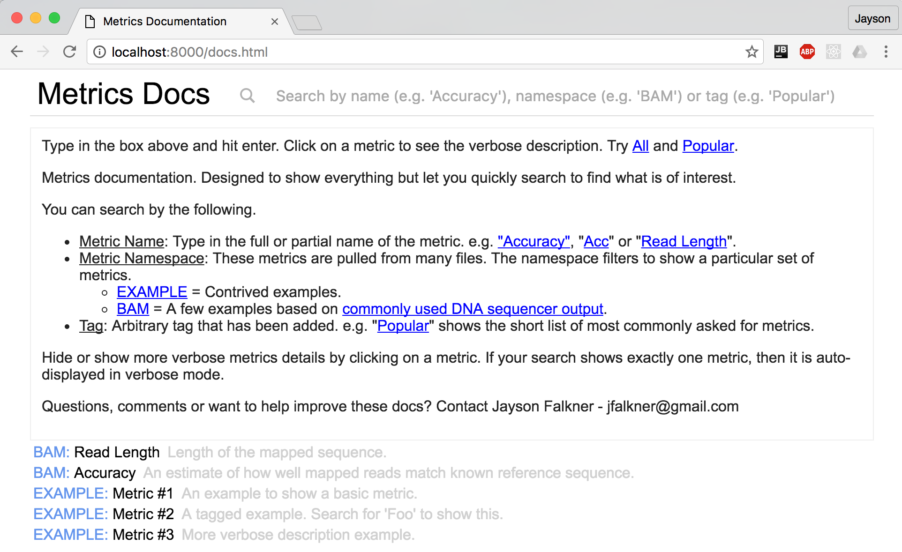
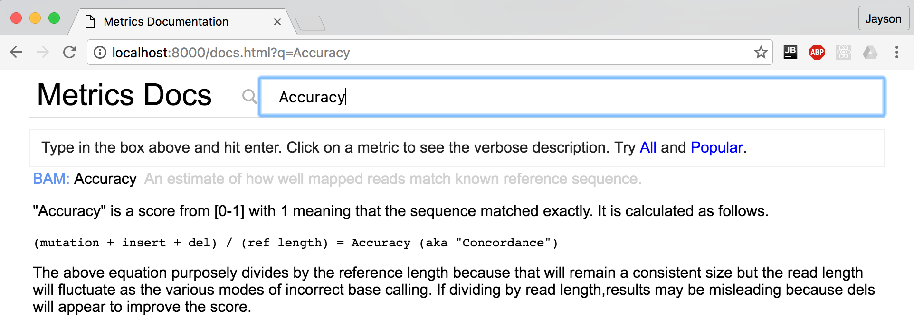
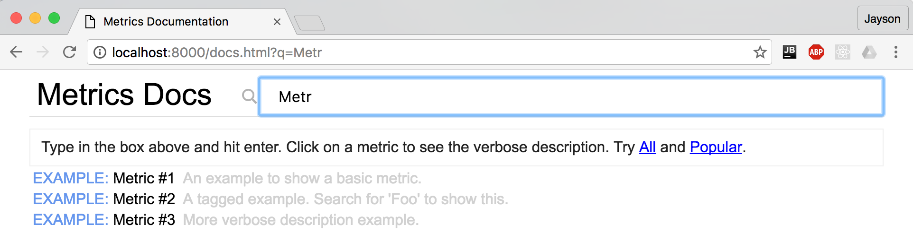
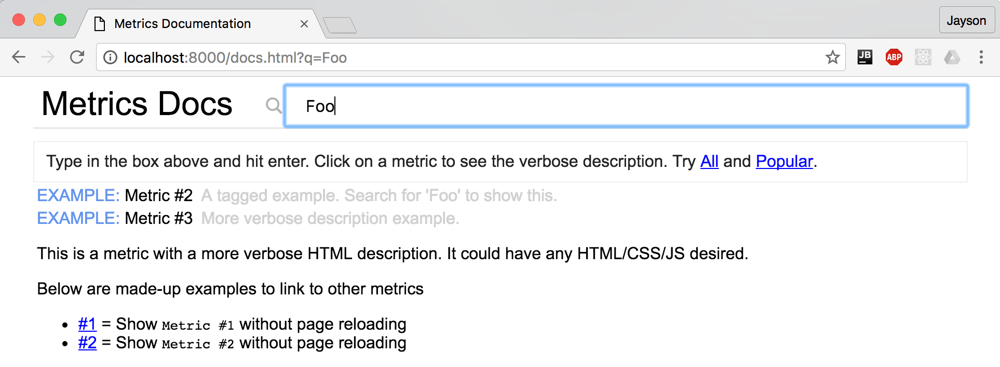

# Metrics Documentation

Make searchable, easy-to-use web documentation for [metrics](https://github.com/jfalkner/metrics) or really anything. The design here is to have interactive web content (HTML/CSS/JS + ReactJS) that summarizes verbose docs. The sort of docs everyone needs to know but won't read because is it otherwise probably a big table in Word doc stashed in your company's document management system.

With this setup, you have a simple way to quickly lookup by name, namespace or tag. And direct links with ?q= can specify what metric to show.

## Usage

The main entry point is docs.html which includes the JS related to you project.

ReactJS makes it simple to write docs in HTML-style but without boilerplate for common formatting and with the option to add custom HTML as needed. For example below are two metrics:

```
# metrics-example.jsp
<Metric ns="EXAMPLE" name="Metric #1" desc="An example to show a basic metric."/>
<Metric ns="EXAMPLE" name="Metric #2" tags={["Foo"]} desc="A tagged example. Search for 'Foo' to show this."/>
<Metric ns="EXAMPLE" name="Metric #3" tags={["Foo"]} desc="More verbose description example.">
  <p>This is a metric with a more verbose HTML description. It could have any HTML/CSS/JS desired.</p>
  <p>Below are made-up examples to link to other metrics</p>
  <ul>
    <li><Search term="Metric #1">#1</Search> = Show <code>Metric #1</code> without page reloading</li>
    <li><Search term="Metric #2">#2</Search> = Show <code>Metric #2</code> without page reloading</li>
  </ul>
</Metric>

# Used from metrics-bam.js
<Metric ns="BAM" name="Read Length" desc="Length of the mapped sequence."/>
<Metric ns="PBBAM" name="Accuracy" tags={["Popular"]} desc="An estimate of how well mapped reads match known reference sequence.">
  <p>"Accuracy" is a score from [0-1] with 1 meaning that the sequence matched exactly. It is calculated as follows.</p>
  <code>
  (mutation + insert + del) / (ref length) = Accuracy (aka "Concordance")
  </code>
  <p>The above equation purposely divides by the reference length because that will remain a consistent size but
  the read length will fluctuate as the various modes of incorrect base calling. If dividing by read length,
  results may be misleading because dels will appear to improve the score.</p>
</Metric>
```

You can also add in images, interactive SVG and anything else used by common web stacks.

```
# download the files from git
git clone http://bitbucket.nanofluidics.com:7990/scm/itg/metrics-docs.git

# start a web server
cd metrics-docs
python -m SimpleHTTPServer
```

Checkout this repo and run `python -m SimpleHTTPServer` to host it.
 
Point your browser to http://127.0.0.1:8000 and you'll see the resulting docs page.
 


As documented on the page, you can search by a metric's full name such as "Accuracy". Notice it auto-expands the verbose docs for the exact match.



A partial name search such as "Acc" works too and will show all matching results.



You can also search by namespace (e.g. "EXAMPLE" or "BAM") or arbitrary tags such as "Popular". Below shows a tag search for "Foo" and example that matches tags on two of the three example metrics.



## Hosting

This repository is a HTML/CSS/JS website. You can host it locally as in
the example, but it probably more practicaly to host it directly from a 
web server your team uses or something such as AWS's S3 or even GitHub's
pages.